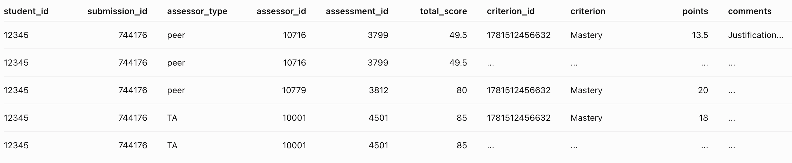

# 背景

本次API尝试数据获取是在Canvas这一学习管理系统中开展，目的是为推进某项教育研究的数据分析。该教育研究是为了**分析Peer review活动对学生某高阶思维的影响**，因此**需要Peer review活动与学生高阶思维等相关数据**。 

本次Canvas API实战主要参考Canvas官方的API文档并在ChatGPT协助下落地，总共分为几个阶段：

## 初始工作流（已反思）

1. 在Postman中利用 **GET 以及相关命令行** 开展初始数据获取测试，对应到Canvas实际课程的学生作业与其成绩数据**查看返回结果是否准确**。 

   **反思**：后续这一步被我删除，尤其是在时间紧的情况下，没必要**在数据是否符合需求的判断之前**就核对返回数据是否准确。 
   
   这一步的核对可以在下面第 2 步中直接开展，**在获得想要数据类型和结果的基础上再去核对数据是否准确更高效**。

   （但我是第一次现实中的实战，所以对API返回后的结果尤其想要看看是否准确。）

2. 在上述结果准确后，查看数据类型和结果是否符合该教育研究数据的需求。 

    在多次返回结果中均未发现"assessment_type": "peer_review"的数据结果，而是默认为"assessment_type": "grading"的大量数据。本次教育研究需要的数据包括Peer review和grading的数据，因此多次尝试不同的API需求命令。 

    **反思**：快速搜索返回数据中**是否包含关键字段**，判断是否符合研究数据的需求。这里的关键字段即"assessment_type": "peer_review"。

3. 多次尝试后，终于返回的数据既包含 Peer review 又包含 grading 的数据。但需要利用 Python 脚本将这些数据整理成最终的长数据类型，可能长下面这样： 

   

    这部分的脚本代码我让ChatGPT先写了草稿，接着就尝试在 [CanvasAPI_Coding.ipynb](CanvasAPI_Coding.ipynb) 中测试和查看结果，根据自身需求调试代码。

## 参考文档：

Canvas API相关文档：

https://developerdocs.instructure.com/services/canvas/resources/rubrics 

https://developerdocs.instructure.com/services/canvas/resources/submissions 

https://developerdocs.instructure.com/services/dap/dataset/dataset-namespaces/dataset-canvas?utm_source=chatgpt.com 

