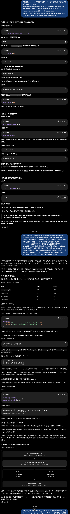
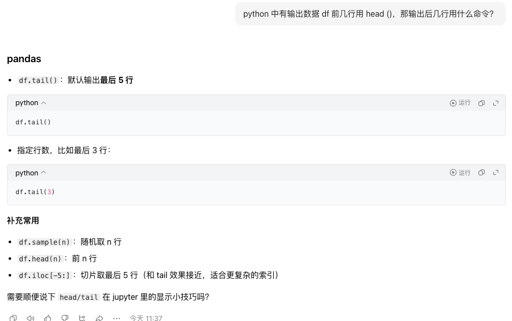
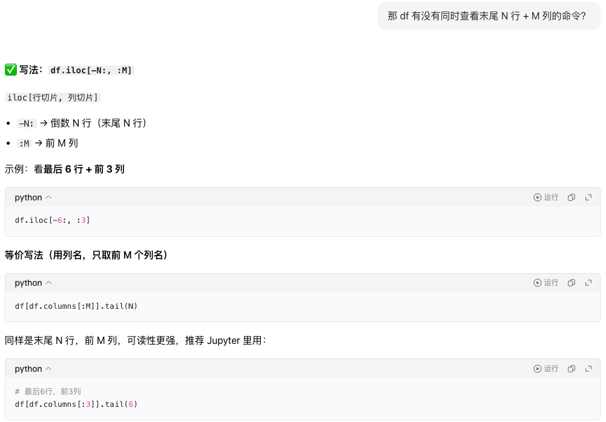
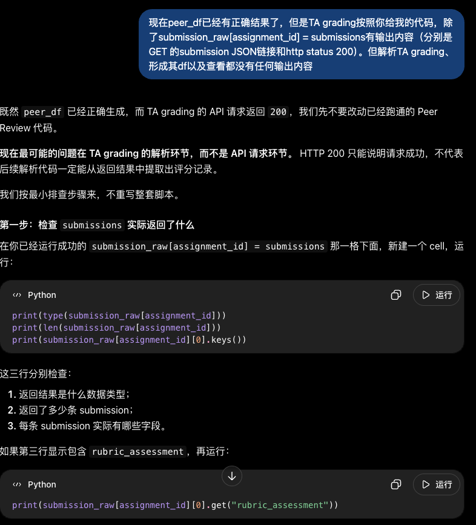
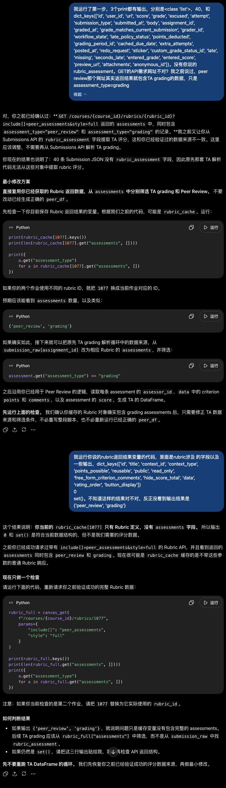

# 背景

本次API尝试数据获取是在Canvas这一学习管理系统中开展，目的是为推进某项教育研究的数据分析。该教育研究是为了**分析Peer review活动对学生某高阶思维的影响**，因此**需要Peer review活动与学生高阶思维等相关数据**。 

本次Canvas API实战主要参考Canvas官方的API文档并在ChatGPT协助下落地，总共分为几个阶段：

## 初始工作流（已反思）

1. 在Postman中利用 **GET 以及相关命令行** 开展初始数据获取测试，对应到Canvas实际课程的学生作业与其成绩数据**查看返回结果是否准确**。 

   **反思**：后续这一步被我删除，尤其是在时间紧的情况下，没必要**在数据是否符合需求的判断之前**就核对返回数据是否准确。 
   
   这一步的核对可以在下面第 2 步中直接开展，**在获得想要数据类型和结果的基础上再去核对数据是否准确更高效**。

   （但我是第一次现实中的实战，所以对API返回后的结果尤其想要看看是否准确。）

2. 在上述结果准确后，查看数据类型和结果是否符合该教育研究数据的需求。 

    在多次返回结果中均未发现"assessment_type": "peer_review"的数据结果，而是默认为"assessment_type": "grading"的大量数据。本次教育研究需要的数据包括Peer review和grading的数据，因此多次尝试不同的API需求命令。 

    **反思**：快速搜索返回数据中**是否包含关键字段**，判断是否符合研究数据的需求。这里的关键字段即"assessment_type": "peer_review"。

3. 多次尝试后，终于返回的数据既包含 Peer review 又包含 grading 的数据。但需要利用 Python 脚本将这些数据整理成最终的长数据类型，可能长下面这样： 

   

    这部分的脚本代码我让ChatGPT先写了草稿，接着就尝试在 [CanvasAPI_Coding.ipynb](CanvasAPI_Coding.ipynb) 中测试和查看结果，根据自身需求调试代码。

Last update: 2026-10-6 

## 代码调试与调整反思

1. **`.env` 环境变量的文件要单独创建**

    作为一个初级小白，我连 `.env` 这样的环境变量文件需要单独创建来放置 API 请求地址和 Access Token 都不知道。
    
    于是一开始，我根据 AI 的代码（但当时没看懂`.env`的配置），直接在 Python 中创建了 2 个字符串变量，专门定义了 API 需求的主要地址和 Access Token。

    **反思**：其实这非常危险⚠️ 一方面，这样的密钥暴露在代码中，一旦代码被Git到云端且公开访问，那所有人都将拥有该 API 地址的访问权限。

2. **创建`.gitignore`可以避免同步环境变量文件**
    
    ChatGPT提醒我，在Jupiter Notebook文件所在的文件夹中创建 `.gitignore` 文件并写明其中的`.env`可以避免在git代码到云端时，暴露密钥信息。

    我自己尝试了一下，果然在 Git Push 之后，`.env` 中的环境变量没有被同步到云端。这一点，必须夸夸AI，因为它能主动补足我没有经验或不懂的领域。

3. **调试代码**

    1. <u>理解代码功能逻辑 + 多次测试</u>

        ChatGPT 给的大部分代码都是可以直接成功运行的，但我在运行后看到结果会倒推程序实现的功能，然后和AI聊聊自己的理解是否正确。AI会给出及时的反馈，纠正我不正确的理解并给出具体的例子。
    
        我甚至还从AI那里知道了 *Http 状态码 `200` = 请求成功*。之前虽然浅显地学习了API请求方式，但其实对 Http 的协议不是特别熟悉（曾经也学过计算机网络和TCP/IP，但实在已经忘完了）。
    
        有时候程序运行会报错，于是把报错信息直接贴给AI。AI则会直接开始详细分析，并且给出测试问题的方案。我是个懒鬼，不想从头来写代码，通常会让AI告诉我最少工作量的简洁修改方式。比如下图： 

        

    2. <u>看到 DataFrame(df) 的默认语法局限性</u>

        此外，当代码测试完成、结果输出后，有时候具有迷惑性。比如，Python通常会直接以 head() 命令输出 df 的前 6 行，但当 df 长度较长时，就无法看到输出数据的全貌。

        我当时看到不完整的数据和大量   `NaN` 的出现，产生了一种前面写的代码有问题、没有把数据整理完成的错觉。后来想要更清晰地看到 df 的全貌，于是也是开始问豆包 df 的前 N 行怎么输出：

         

        以及，df 的后 M 行后 N 列怎么输出：

         

        这些语法的效果非常好，让我看到了已生成 df 的全貌，没有误判前面代码有错误。毕竟，长长的函数如果要排查其中数据获取错误的细节，估计也要费一番功夫。

    3. <u>AI 可能也会犯糊涂</u>

        前期其实我就和ChatGPT说过了，我是从某一个API 需求地址中直接拉回了所有 Peer review 和 TA grading的数据。也就是说，如果Peer review数据从某个地址已经实现数据整理，那相应地这个地址里也可以取出TA grading的数据来整理。但实际上 TA grading的数据持续没有结果： 

         

        我依据 AI 反馈测试后发现输出内容并不和AI 预测的吻合，开始怀疑这里 TA grading拉取数据的地址不对。和AI 聊时，它又开始胡说：

         

        但我在Jupiter Notebook中的测试结果依然不对。于是我开始找上面 Peer review数据获取成功的API需求地址。发现用于Peer review的API需求对参数的核心定义是这样的：

        ```Python
        data = canvas_get(
        f"/courses/{course_id}/rubrics/{rubric_id}",
        params={
            "include[]": "peer_assessments",
            "style": "full"
        }
        ```

        但实际上，我在Postman中测试API返回完整的数据时，用的API需求地址是https://hkust-gz.instructure.com/api/v1/courses/3308/rubrics/1077?include[]=assessments&style=full。
        
        显然，其中`include[]`参数定义不匹配。因此，AI一开始给出的全套代码前后的API需求地址没有按照我的要求用统一的前述地址。那明天的任务就是利用这个地址去提取 TA grading的数据并整理好。

Last update: 2026-10-9


## 参考文档：

Canvas API相关文档：

https://developerdocs.instructure.com/services/canvas/resources/rubrics 

https://developerdocs.instructure.com/services/canvas/resources/submissions 

https://developerdocs.instructure.com/services/dap/dataset/dataset-namespaces/dataset-canvas?utm_source=chatgpt.com 


